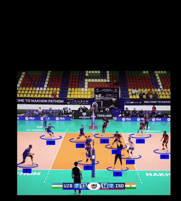

# 🏐 VolleyTrack

VolleyTrack is a **computer vision project** that tracks the volleyball and players in match recordings or clips.  
It also supports simple action recognition (like serve, pass, spike, etc.) and saves the processed outputs as videos.

## 📹 Demo Video
➡️


## 📂 Project Structure
```
VOLLEYTRACK/
├── actions/                # Action recognition module
│   ├── actions_reco.py
├── LICENSE
├── main.py                 # Entry point
├── mod/                    # Model weights
│   └── action_detection_3.pt
├── output/                 # Processed videos
│   ├── 1_simple st.avi
│   ├── 1_video.avi
│   ├── 2_add ball.avi
│   └── add_action.avi
├── README.md
├── Tracker/                # Tracking module
│   └── tracker.py
├── Tracking_history/       # Saved track histories
│   ├── tracks_7.pkl
│   └── tracks.pkl
├── utils/                  # Helper functions
│   ├── bbox_utils.py
│   └── video_utils.py
└── volleball.py            # Main pipeline script
```

---

## 📌 Notes
- Input: Any volleyball match video/clip.  
- Output: Tracked video + optional action recognition overlay.  

---

## 📜 License
This project is released under the MIT License.
